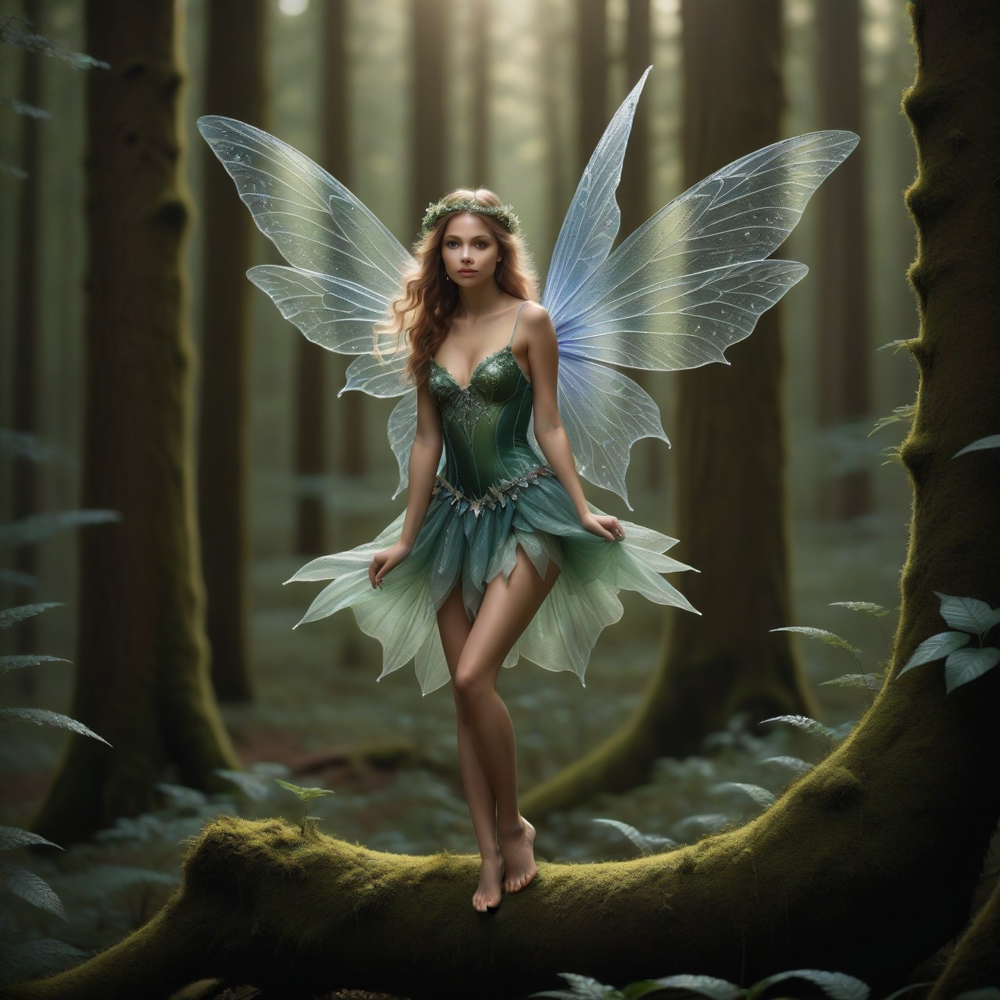

# TXT2IMG

**2026 Jeff Molofee (NeHe)**

A Windows desktop app (WinUI 3) that generates images from a text prompt entirely on your own PC, then copies the result straight to your clipboard. No account, no API keys, no cloud — everything runs locally on your GPU.

---

<p align="center"></p>

---

## Download

Grab the latest build from the [Releases page](https://github.com/NeHeGL/TXT2IMG/releases) — download `TXT2IMG-vX.Y.Z-windows-x64.zip`, extract anywhere, and run `TXT2IMG.exe`.

If you don't already have it (most Windows 11 PCs do, from other WinUI apps), install the [Windows App SDK Runtime](https://learn.microsoft.com/en-us/windows/apps/windows-app-sdk/downloads) first — a small, one-time Microsoft redistributable, same idea as a VC++ Redistributable.

---

## Features

- **100% local** — prompts and images never leave the device
- **Style presets** — ordered from simplest to most detailed/photorealistic, grouped by kinship where that matters more than raw detail level (e.g. Claymation sits with the physical-medium styles, not the CG-render ones): Cartoon, Icon, Comic Book, Cel-Shaded, Anime, Watercolor, Oil Painting, Claymation, Fantasy Art, Pixel Art, 3D Render, Photorealistic, Vintage Photo — with a live description of what each one produces
- **Aspect ratio picker** — Square, Landscape/Portrait 16:9, Landscape/Portrait 4:3, correctly scaled per-model rather than just stretching a square canvas
- **Reference photo (img2img)** — load your own photo as a starting point, or click the ↻ badge on any result to build on it for the next prompt
- **Creativity slider** — controls how far a result is allowed to drift from the reference photo, from a light touch-up to a full reinterpretation
- **Generates 5 variations per prompt** so you can pick the best result
- **Copy to clipboard or save as PNG** — save suggests a filename that includes the panel number and style, e.g. `fairy-with-wings-2-icon.png`

---

## Usage

1. Type a prompt and press Enter (or click **Generate**)
2. Pick a **Style** and **Aspect Ratio** — the panel next to the results shows a description of the selected style
3. Optionally click **Add Reference Photo** to use your own image as a starting point, and adjust **Creativity** to control how closely results stick to it
4. Click any of the 5 results to preview it, or the ↻ badge to use it as the reference for your next prompt
5. **Copy to Clipboard** or **Save as PNG**

---

## Models

Runs Stable Diffusion XL locally via [OnnxStack](https://github.com/saluteai/OnnxStack) and ONNX Runtime with DirectML. Two models are available, downloaded on first use into `%LocalAppData%\TXT2IMG\Models\`:

- **DreamShaper XL (fast)** — distilled for low-step inference, the default
- **SDXL Base (standard)** — the official Stability AI base model

---

## What's new since v1.0.0

- **Style lineup overhauled** — Illustration, Realistic, and Ultra High-Res were removed (each either overlapped another style too closely or couldn't reliably hit its intended look), replaced with Comic Book, Anime, Claymation, Fantasy Art, Pixel Art, 3D Render, and Vintage Photo. Cel-Shaded and Icon were retuned so every style now has a visually distinct identity, each with negative-prompt terms that push away from its closest neighbor.
- **Fixed occasional GPU hang (`DXGI_ERROR_DEVICE_HUNG`) mid-batch** — a denoising/VAE step at native 1024 resolution could trip Windows' driver watchdog (TDR) on some GPUs. The model's baseline resolution was lowered to 768.
- **Fixed anatomy artifacts (fused/extra limbs, malformed hands/feet/poses)** — broadened the negative prompt to cover fused limbs and foot/toe deformities, and raised the fast model's inference steps (8 → 12, with a further 50% boost on non-square aspect ratios) to give it more denoising budget to resolve complex poses. This reduces but doesn't fully eliminate the issue on very complex or ambiguous poses — regenerating or switching to SDXL Base remain the reliable fallbacks.
- **Fixed non-square aspect ratios (Landscape/Portrait) reintroducing anatomy/GPU-hang risk** — dimensions are now computed by capping the long edge at the model's native resolution rather than stretching to match the square default's total pixel area.
- **Fixed flat/vector styles (Cartoon, Icon, Cel-Shaded) occasionally rendering photorealistic instead of the requested style** — a guidance-scale increase scoped to those styles forces stronger adherence to the requested look.
- **Fixed the ↻ reference-photo badge looking like it did nothing** — selecting a result via its badge now updates the Reference Photo panel directly (as if that image had been loaded from disk), and the whole thumbnail highlights, not just the badge's own border.
- **Fixed the Style dropdown's scrollbar not responding to the mouse wheel** — a known WinUI3 bug ([microsoft-ui-xaml#8764](https://github.com/microsoft/microsoft-ui-xaml/issues/8764)) where unpackaged desktop apps get misreported as "inactive," breaking automatic wheel-to-scroll routing. Wheel input is now applied to the dropdown directly; the window was also made taller and each dropdown row more compact so the full style list fits without scrolling.
- **Fixed result thumbnails and the style description box overflowing off the right edge on Landscape/Portrait aspect ratios** — result-slot sizing now accounts for available row width, not just height.

---

## Requirements

- Windows 10/11 x64 with a DirectX 12 compatible GPU (DirectML)
- [Windows App SDK Runtime](https://learn.microsoft.com/en-us/windows/apps/windows-app-sdk/downloads) 1.7+ (one-time install, see Download above)

---

## Building from source

Requires the [.NET 8 SDK](https://dotnet.microsoft.com/download/dotnet/8.0) with the Windows App SDK workload.

**To produce a distributable `.exe`** (the same self-contained build used for GitHub Releases), run **`build.bat`** from the project root — it publishes a Release, self-contained `win-x64` build to `publish\TXT2IMG.exe`.

**For development** (debugging in Visual Studio), open `TXT2IMG.csproj`, or from a terminal:

```bat
dotnet build TXT2IMG.csproj
```

It targets `net8.0-windows10.0.19041.0` with WinUI 3.

---

## Project layout

- [App.xaml](App.xaml) / [App.xaml.cs](App.xaml.cs) — application entry point
- [MainWindow.xaml](MainWindow.xaml) / [MainWindow.xaml.cs](MainWindow.xaml.cs) — main UI and generation flow
- [LocalImageGenerator.cs](LocalImageGenerator.cs) — OnnxStack pipeline wrapper
- [ModelDownloader.cs](ModelDownloader.cs) — model catalog and on-demand download
- [ExecutionProviders.cs](ExecutionProviders.cs) — DirectML/CPU execution provider setup

---

## Author

2026 Jeff Molofee (NeHe)
